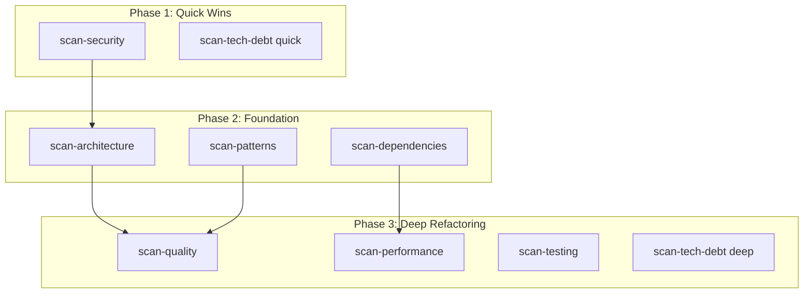

# Generate Orchestrator Plan

## Purpose

Read all per-dimension refactoring plans and produce a single master plan with execution phases, cross-dimension dependencies, and a unified verification strategy.

The key words MUST, MUST NOT, SHOULD, SHOULD NOT, and MAY in this document are to be interpreted as described in RFC 2119.

## Input

- `PLANS`: Array of per-dimension refactoring plans (from generate-refactoring-plan)
- `STACK`: Detected language/framework
- `PROJECT_PATH`: Root directory of the project
- `DIMENSIONS_ANALYZED`: List of dimensions that were scanned

## Workflow

### Step 1 — Categorize Plans by Execution Phase

Assign each dimension's plan to one of three execution phases:

| Phase | Name | Criteria | Rationale |
|-------|------|----------|-----------|
| 1 | Quick Wins | Low risk, small effort, high impact | Build momentum, immediate improvement |
| 2 | Foundation | Architecture, dependencies, patterns | Structural changes that enable other fixes |
| 3 | Deep Refactoring | Quality, performance, tech debt, testing | Changes that benefit from clean foundation |

Security findings MUST be placed in Phase 1 regardless of effort — they are always urgent.

Assignment rules:
- `scan-security` → Phase 1 (always)
- `scan-tech-debt` with effort XS/S → Phase 1
- `scan-architecture` → Phase 2
- `scan-dependencies` → Phase 2
- `scan-patterns` → Phase 2
- `scan-quality` → Phase 3
- `scan-performance` → Phase 3
- `scan-testing` → Phase 3
- `scan-tech-debt` with effort M/L/XL → Phase 3

### Step 2 — Detect Cross-Dimension Dependencies

Analyze file overlap between plans:

1. For each pair of plans, check if they modify the same files
2. If Plan A modifies files that Plan B also modifies:
   - If A is in an earlier phase, B depends on A (correct order)
   - If A and B are in the same phase, flag as potential conflict
   - If A is in a later phase, consider reordering
3. Check for semantic dependencies:
   - Architecture changes SHOULD precede pattern/quality changes
   - Dependency updates SHOULD precede performance optimization
   - Security fixes SHOULD precede everything else

### Step 3 — Build Dependency Graph

Generate a Mermaid flowchart showing:
- Phases as subgraphs
- Plans as nodes within phases
- Dependencies as directed edges
- File conflicts as dashed edges with warning labels

### Step 4 — Build Verification Strategy

For each phase, define verification checks:

**Phase 1 verification**:
- All security findings addressed
- No new vulnerabilities introduced
- Existing tests still pass

**Phase 2 verification**:
- Architecture violations resolved
- Dependency graph is clean
- No circular dependencies
- Build succeeds with updated dependencies

**Phase 3 verification**:
- Quality metrics improved (complexity, duplication)
- Performance benchmarks meet targets
- Test coverage increased
- No regressions from previous phases

### Step 5 — Calculate Effort Summary

Aggregate effort across all plans:
1. Sum findings count per phase
2. Estimate total effort per phase (sum of step efforts)
3. Produce effort summary table

### Step 6 — Produce Master Plan

Compile the orchestrator plan matching the schema from `${CLAUDE_PLUGIN_ROOT}/references/output-schemas.md`.

Return the master plan to the orchestrator.

## Error Handling

| Scenario | Resolution |
|----------|-----------|
| Only one dimension has findings | Produce single-phase plan, skip dependency analysis |
| All plans are empty | Report codebase as clean, no plan needed |
| Circular dependency between plans | Flag conflict, suggest human decision on ordering |
| >100 total findings across dimensions | Suggest splitting execution into sprints |
| File conflicts between same-phase plans | Add explicit ordering within the phase |

## Success Checklist

- [ ] All non-empty plans assigned to a phase
- [ ] Cross-dimension dependencies identified
- [ ] Mermaid dependency graph generated
- [ ] Verification strategy defined per phase
- [ ] Effort summary calculated
- [ ] Security findings in Phase 1
- [ ] Master plan matches orchestrator plan schema
- [ ] Plan returned to orchestrator
