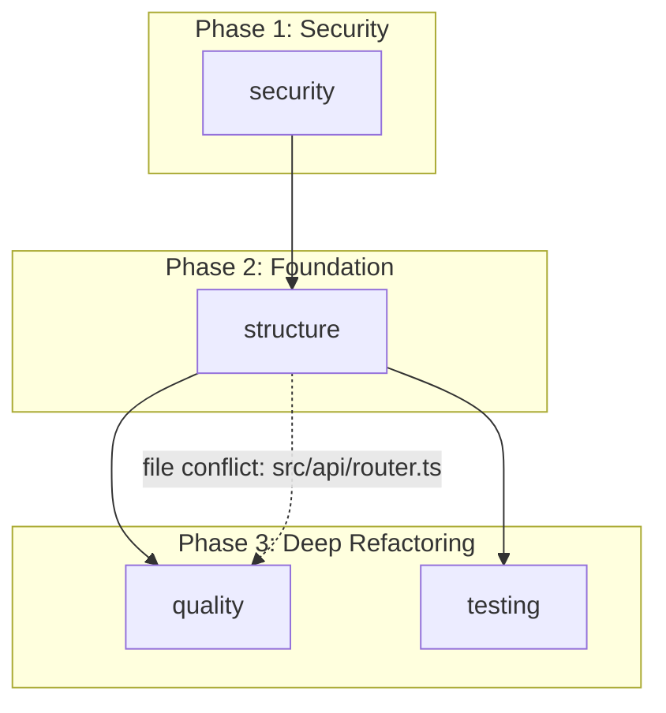

# Generate Orchestrator Plan

## Purpose

Read all per-dimension refactoring plans and produce a single master plan with execution phases, cross-dimension dependencies, and a unified verification strategy.


## Input

- `PLANS`: Array of per-dimension `RefactoringPlan` objects (from `generate-refactoring-plan`)
- `STACK`: Detected language/framework object with `languages` and `frameworks` arrays
- `PROJECT_PATH`: Root directory of the project
- `DIMENSIONS_ANALYZED`: List of dimensions that were scanned (may include dimensions with zero findings)
- `PRIORITY_OVERRIDE` (optional): One of `security-first` (default), `architecture-first`, `quick-wins-first`
- `CRITIC_FEEDBACK` (optional): `CriticFeedback` JSON from a prior `plan-critic` run

## Workflow

### Step 1 — Categorize Plans by Execution Phase

Filter out plans where `steps` is empty. These represent clean dimensions and MUST NOT appear in any phase.

For each non-empty plan, assign it to a phase using the table below. Apply `PRIORITY_OVERRIDE` after the default assignment if one is provided (see override rules at the end of this step).

**Default phase assignment**:

| Phase | Name | Criteria | Rationale |
|-------|------|----------|-----------|
| 1 | Quick Wins | Low risk, small effort, high impact | Build momentum, immediate improvement |
| 2 | Foundation | Architecture, dependencies, patterns | Structural changes that enable other fixes |
| 3 | Deep Refactoring | Quality, performance, tech debt, testing | Changes that benefit from a clean foundation |

**Dimension-to-phase rules (default, security-first)**:

| Dimension | Default Phase | Override condition |
|-----------|---------------|--------------------|
| `security` | 1 | NEVER moved — always Phase 1 |
| `structure` | 2 | — |
| `quality` | 3 | — |
| `testing` | 3 | — |

**Security rule**: Security findings MUST be placed in Phase 1 regardless of effort or any override flag. This is a non-negotiable ordering constraint. If `PRIORITY_OVERRIDE=architecture-first` is set, structure moves to Phase 1 alongside security — it does not displace security.

**Override rules**:
- `security-first` (default): no changes to the table above
- `architecture-first`: move `structure` to Phase 1; push `quality`, `testing` to Phase 3
- `quick-wins-first`: All plans where every step has effort `trivial` or `small` move to Phase 1. Remaining plans follow the default table. Security still MUST be in Phase 1.

If `CRITIC_FEEDBACK` references `ordering-error` issues, apply the critic's suggested reordering before proceeding.

### Step 2 — Detect Cross-Dimension Dependencies

Build a matrix of file overlap between all pairs of non-empty plans:

1. For each plan, collect the union of all `files_affected` across all its steps. Call this the plan's **file set**.

2. For each pair of plans (A, B), compute the intersection of their file sets. If the intersection is non-empty, the plans share files.

3. Apply ordering logic:
   - If A is in Phase N and B is in Phase M where N < M, and they share files: correct order — B depends on A, record a directed edge `A → B`.
   - If A and B are in the same phase and share files: flag as a **within-phase conflict**. Assign explicit ordering within the phase (whichever has higher-severity findings executes first; break ties alphabetically by dimension name).
   - If A is in a later phase than B and they share files: flag as a **phase ordering conflict** and consider moving A to B's phase or earlier.

4. Add semantic dependency edges regardless of file overlap:
   - `structure → quality` (quality improvements depend on clean structure)
   - `structure → testing` (test structure mirrors module structure)
   - `security → structure` (security fixes may affect structural boundaries)

   Only add these edges when both dimensions have non-empty plans.

**Example file overlap detection**:

Plans:
- `structure` file set: `{src/api/router.ts, src/api/handlers.ts, src/services/user.ts}`
- `quality` file set: `{src/api/handlers.ts, src/utils/formatter.ts}`

Intersection: `{src/api/handlers.ts}` — shared file. Structure is Phase 2, quality is Phase 3 → correct order, add edge `structure → quality`.

### Step 3 — Build Dependency Graph

Generate a Mermaid flowchart from the edges computed in Step 2.

Format rules:
- Use `subgraph` blocks for each phase
- One node per non-empty plan, labeled with the dimension name
- Directed edges (`-->`) for cross-phase dependencies
- Dashed edges (`-.->`) with a label for within-phase conflicts: `-.->|"file conflict: src/api/handlers.ts"|`
- Edges from Step 2 semantic dependencies that are cross-phase: use solid `-->`
- Self-edges are not valid — do not emit them

**Example**:



If only one phase is non-empty, emit a single-node diagram with no edges.

### Step 4 — Build Verification Strategy

For each phase that contains at least one plan, define a `VerificationEntry` object:

```json
{
  "phase": 1,
  "checks": [
    "Run full test suite: all tests must pass",
    "No new findings introduced (re-run affected scan dimensions if CI supports it)",
    "...phase-specific checks..."
  ]
}
```

**Phase 1 verification**:
- All security findings addressed (manually verify by finding ID)
- No new vulnerabilities introduced (run dependency audit: `npm audit` / `pip-audit` / equivalent for the detected stack)
- Existing tests still pass
- If quick-win tech-debt steps were included: lint passes, no new warnings

**Phase 2 verification**:
- Architecture violations resolved (no circular imports — run `madge --circular` for JS/TS, `pylint` for Python, or equivalent)
- Dependency graph is clean (run `npm ls` or `pip check` — no unresolved peer deps)
- No circular dependencies
- Build succeeds with updated dependencies
- If patterns were updated: run pattern-specific linting rules

**Phase 3 verification**:
- Quality metrics improved (run complexity analysis: `complexity-report` for JS, `radon` for Python — critical functions below threshold)
- Performance benchmarks meet targets (run `k6`, `ab`, or project-specific benchmark suite)
- Test coverage at or above pre-refactoring baseline
- No regressions from Phase 1 or Phase 2 (run full test suite again)

If the detected `STACK` enables a more specific check (e.g., `STACK.frameworks` includes `"react"`), add framework-specific checks: `"Run Lighthouse accessibility audit — score must not regress below pre-refactor baseline"`.

### Step 5 — Calculate Effort Summary

For each phase, compute:

1. **Findings count**: Sum of total findings covered across all plans in the phase
2. **Total effort**: Map each effort level to hours using the scale below, sum across all steps in all plans in the phase, then convert to developer days (8h = 1d):

   | Effort | Hours |
   |--------|-------|
   | trivial | 0.25 |
   | small | 0.75 |
   | medium | 2.5 |
   | large | 6 |
   | xl | 12 |

3. Produce a per-phase effort string: `"~0.5d"`, `"~1-2d"`, etc. Round to nearest half-day. If total is < 0.5d, use `"< 0.5d"`.

4. Produce the `total_effort_estimate` string summing all phases: `"3-5 developer days"`. Use a range to communicate uncertainty: add 50% buffer for plans with `overall_risk: high`.

**Example calculation**:

Phase 1 steps: 2 × small (0.75h), 1 × medium (2.5h) = 4h = 0.5d
Phase 2 steps: 3 × medium (7.5h), 1 × large (6h) = 13.5h ≈ 1.5d
Phase 3 steps: 2 × large (12h), 2 × xl (24h) = 36h = 4.5d
Total: ~6.5d; with risk buffer (Phase 3 has high-risk steps): `"6-10 developer days"`

### Step 6 — Produce Master Plan

Compile the `OrchestratorPlan` object matching the schema in `${CLAUDE_PLUGIN_ROOT}/references/output-schemas.md`:

```json
{
  "metadata": {
    "date": "<today ISO date>",
    "project_path": "<PROJECT_PATH>",
    "dimensions_analyzed": ["<DIMENSIONS_ANALYZED>"],
    "stack": { "languages": [...], "frameworks": [...] }
  },
  "execution_phases": [
    {
      "phase": 1,
      "name": "Quick Wins & Security",
      "description": "Addresses all critical security findings and low-effort improvements.",
      "plans": ["security"],
      "rationale": "Security findings are always urgent and must be addressed first."
    }
  ],
  "dependency_graph": {
    "mermaid_code": "graph TD\n    ..."
  },
  "verification_strategy": [ ... ],
  "total_effort_estimate": "..."
}
```

The `execution_phases[].rationale` MUST explain the specific reasoning for grouping those dimensions together — it cannot be a generic statement. Reference the actual dimension names and finding types.

Return the master plan to the calling `refactoring-planner` agent. Do not write the file yourself.

## Error Handling

| Scenario | Resolution |
|----------|------------|
| All input plans are empty (zero steps) | Return a minimal plan with `execution_phases: []`, `total_effort_estimate: "0"`, and include a note in metadata: `"Codebase is clean — no refactoring needed."` |
| Only one dimension has non-empty findings | Produce a single-phase plan with one entry in `execution_phases`. Set `dependency_graph.mermaid_code` to a single node with no edges. Skip the cross-phase dependency analysis. |
| Circular dependency between plans | Cannot produce a valid ordered plan. Flag in `execution_phases` metadata: `"WARNING: circular dependency detected between {A} and {B}. Human decision required on ordering."` Present both orderings to the user and ask them to choose. |
| >100 total findings across all dimensions | Add to `metadata` a `sprint_recommendation` field (string) suggesting splitting execution across sprints: `"Consider splitting into 2 sprints: Phase 1-2 in Sprint 1, Phase 3 in Sprint 2."` |
| Within-phase conflict cannot be resolved by severity tiebreak | Order alphabetically by dimension name and add a note: `"Execution order within Phase N is advisory — validate file overlap before executing."` |
| CRITIC_FEEDBACK contains ordering-error blocking issue | Apply the critic's suggested reordering before generating the Mermaid graph. If the suggestion is ambiguous, surface the ambiguity in the plan and ask the user. |

## Success Checklist

- [ ] All non-empty plans assigned to exactly one phase
- [ ] Empty plans excluded from all phases
- [ ] Security dimension always in Phase 1
- [ ] Cross-dimension file overlaps detected and edges generated
- [ ] Semantic dependency edges added where both dimensions are non-empty
- [ ] Mermaid diagram generated and syntactically valid
- [ ] Verification strategy defined for every non-empty phase
- [ ] Per-phase effort calculated with correct formula
- [ ] `total_effort_estimate` uses a range and accounts for risk
- [ ] `execution_phases[].rationale` is dimension-specific, not generic
- [ ] Master plan matches OrchestratorPlan schema
- [ ] Plan returned to refactoring-planner (not written to disk)
